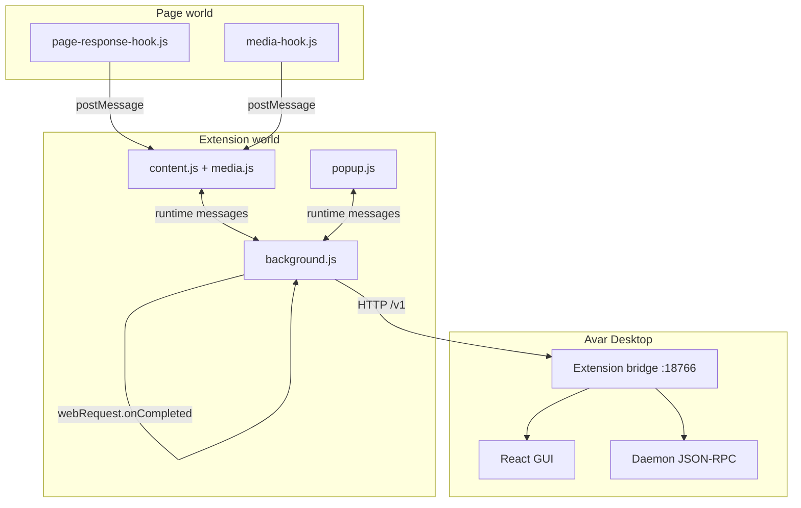

# Extension Architecture

Technical reference for the Avar browser extension codebase. For user-facing behavior, see [Extension Behavior]({{ site.baseurl }}/extensions/behavior.html). For agent maintenance contracts, see `.agents/skills/extension-development/BEHAVIOR.md`.

## Repository layout

```
extensions/
├── shared/          # Source of truth — edit here first
├── chromium/        # Manifest V3 (Chrome, Edge, Opera)
├── firefox/         # Manifest V2 (Firefox)
└── packages/        # Built ZIPs (avar-chromium.zip, avar-firefox.zip)
```

`gui/vite-extensions.ts` copies these files from `shared/` into both browser folders on build:

`media.js`, `protocol.js`, `capture.js`, `hls.js`, `context-menu.js`, `download-intercept.js`, `popup.js`, `popup.html`, `page-response-hook.js`, `media-hook.js`, `content.js`

Browser-specific files (not synced): `background.js`, `manifest.json`, icons.

## Process model



| Component | Context | Role |
|-----------|---------|------|
| `content.js` | Isolated content script | Merge captures, selection widget, inject page hooks |
| `media.js` | Shared library | URL classification, DOM scan, merge/sort/filter |
| `capture.js` | Background | Per-tab network capture via `webRequest` |
| `page-response-hook.js` | Page (injected) | Wrap fetch/XHR; scan response bodies |
| `media-hook.js` | Page (injected) | Hook media element `src`; MutationObserver |
| `background.js` | Service worker / background page | Bridge client, context menus, download intercept |
| `popup.js` | Extension page | UI, scan orchestration, settings |
| `protocol.js` | Shared | Bridge HTTP client, URL normalization |
| `hls.js` | Shared | HLS master playlist expansion |
| `context-menu.js` | Background | Context menu IDs and lifecycle |
| `download-intercept.js` | Background | `downloads.onCreated` handler |

## Media item shape

```typescript
interface MediaItem {
  url: string;
  kind: "direct" | "hls" | "dash";
  filename?: string;      // from response headers or probe
  size?: number;          // bytes, from headers or probe
  hlsLabel?: string;      // after HLS expansion
  hlsResolution?: string;
  masterUrl?: string;     // original master before expansion
}
```

### Merge rules (`mergeMediaItems`)

- Deduplicate by URL (`Map`)
- Prefer non-`direct` kind over `direct` when merging
- Fill in `filename` and `size` from whichever source has them

### Listing rules (`shouldListMediaItem`)

- Always list `hls` and `dash`
- List `direct` unless URL matches HLS segment pattern (`.ts`, `.m4s`, `.cmfv`, `.cmfa`, `.aac`, `.vtt`, `.key`)
- Other kinds are not listed

### Categories (`classifyMediaCategory`)

Order for default sort: video (0) → audio (1) → image (2) → binary (3).

## Content script flow

1. **Startup:** `installPageHooks()` injects `page-response-hook.js` and `media-hook.js` via `<script src="chrome-extension://…">`.
2. **Messages from page:** `avar-response-body` → `rememberHookedText()`; `avar-media-urls` → `rememberHookedUrls()`.
3. **Collect:** `collectPageMedia()` = merge(`collectMediaItems`, `collectDomVideoItems`, hooked map).
4. **Selection:** `collectSelectedLinkItems()` reads `window.getSelection()` ranges; caches 60 s; context menu snapshot 30 s.
5. **Popup request:** responds to `avar-get-page-media` with `{ items, selectedItems, pageTitle }`.

## Background collection

`collectFromTab(tabId)`:

1. `tabs.sendMessage` → content script items + selectedItems
2. `networkCapture.getForTab(tabId)` → header-classified URLs
3. `AvarMedia.mergeMediaItems(dom, captured)`

On content script failure, returns network captures only.

Network capture clears on tab URL change or tab close.

## Bridge client (`protocol.js`)

- **Default URL:** `http://127.0.0.1:18766`
- **`normalizeBridgeUrl`:** Only accepts localhost/`127.0.0.1`/`[::1]` on port **18766**; otherwise falls back to default
- **`discoverBridgeUrl`:** Ping stored URL, then default
- **`ensureBridgeReachable`:** Ping; on failure wake via `avar://focus` tab; retry with backoff
- **Timeout:** 2 s per fetch

Bridge implementation: `gui/electron/extension-bridge.cjs` (also used by Electron main process).

## Storage keys (`chrome.storage.local`)

| Key | Type | Default |
|-----|------|---------|
| `bridgeUrl` | string | `http://127.0.0.1:18766` |
| `guiUrl`, `daemonUrl` | string | Legacy aliases; synced with `bridgeUrl` |
| `defaultQueueId` | string | `""` |
| `defaultMediaFilter` | string | `"all"` |
| `mediaSort` | string | `"type"` |
| `showSelectionWidget` | boolean | `true` |
| `selectionWidgetOpacity` | number | `100` (clamped 40–100) |
| `selectionWidgetTheme` | `"dark"` \| `"light"` | `"dark"` |
| `selectedLinksInSeparateTab` | boolean | `true` |
| `grabAllDownloads` | boolean | `true` |
| `blockBrowserDownloads` | boolean | `true` |
| `activeListTab` | `"selected"` \| `"media"` | `"media"` |
| `popupWidth` | number | `420` |
| `popupHeight` | number | `560` |

## Internal runtime messages

Background `chrome.runtime.onMessage` handlers:

| Type | Direction | Purpose |
|------|-----------|---------|
| `avar-get-page-media` | BG ← CS | Popup/context menu media query |
| `avar-selection-changed` | BG ← CS | Update context menu enabled state |
| `avar-list-media` | Popup → BG | Scan active tab |
| `avar-ping-bridge` | Popup/CS → BG | Bridge health |
| `avar-set-config` | Popup → BG | Persist settings |
| `avar-open-add-download` | Popup → BG | Single Add download dialog |
| `avar-open-batch-add` | Popup → BG | Batch Add downloads dialog |
| `avar-open-downloads` | CS → BG | Selection widget bulk open |
| `avar-add-download` | Legacy | Direct add (download intercept uses `openSingleAdd`) |
| `avar-probe-size` | Popup → BG | HEAD/probe via bridge |
| `avar-expand-hls-items` | Popup → BG | HLS variant expansion |
| `avar-list-queues` | Popup → BG | Queue picker population |
| `avar-queue-start` / `avar-queue-stop` | Popup → BG | Queue control |

Content script listens only for `avar-get-page-media`.

## Context menu IDs

Defined in `context-menu.js`:

- `avar-root` — submenu parent (page context)
- `avar-download-selected` — enabled when selection has links
- `avar-download-all-sub` — download all page media
- `avar-download-link` — link context

Firefox/Chromium: `contextMenus.onShown` refreshes selection state before display (when supported).

## Manifest differences

| Feature | Chromium (MV3) | Firefox (MV2) |
|---------|----------------|---------------|
| Background | Service worker + `importScripts` | Classic background scripts array |
| Script injection | `web_accessible_resources` + content script inject | Same pattern |
| Permissions | `scripting`, `host_permissions` | Combined `permissions` |

Both request: `activeTab`, `storage`, `contextMenus`, `webRequest`, `downloads`, `tabs`, `<all_urls>`, localhost.

## Classification module (`media.js`)

Public API on `globalThis.AvarMedia`:

- **Discovery:** `collectMediaItems`, `collectDomVideoItems`, `collectSelectedLinkItems`, `collectPerformanceMediaItems`, `mergeMediaItems`
- **Classification:** `classifyMediaUrl`, `classifyCapturedRequest`, `classifyStreamKind`, `classifyMediaCategory`
- **Display:** `itemDisplayFilename`, `formatFileSize`, `formatDisplayUrl`, `filterMediaItems`, `sortMediaItems`, `sortMediaItemsByMode`
- **Listing:** `shouldListMediaItem`, `matchesMediaFilter`

All regex constants are module-level; no hostname checks anywhere.

## Site-agnostic rule

**Never** add hostname checks, site-specific CSS selectors, or per-site extractor modules. Improve generic heuristics in `media.js` instead. Page hooks only discover raw URLs; classification stays in the extension world.

## Testing checklist

Manual verification after changes:

1. Load unpacked extension; confirm green bridge dot with Avar Desktop running
2. Open a page with `<video>` — URL appears after playback starts
3. Open a page with direct `.mp4` link — appears in DOM scan
4. Signed CDN URL (no extension, `sig` + `expires`) — captured via network or response scan
5. Select multiple links — widget and popup Selected tab work
6. Context menu: link download, download all, download selected
7. HLS page — master expands to variants when connected
8. Native browser download with Grab + Block — Avar dialog opens, browser save cancelled
9. Edit `shared/` → run build or `prepareExtensions()` → both `chromium/` and `firefox/` updated
